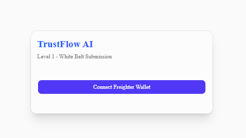

# TrustFlow AI

[](https://stellar.org)
[](https://nextjs.org)
[](https://www.typescriptlang.org/)
[](https://tailwindcss.com)
[](https://www.framer.com/motion/)

TrustFlow AI is an AI-powered Project Operating System designed for freelancers and clients. This repository contains the submission for the Stellar Journey to Mastery program, starting from Level 1 (White Belt) and transitioning to Level 2 with a fully overhauled, premium Web3 UI.

## Project Overview

Our platform demonstrates seamless interaction with the Stellar Network, wrapped in a **Premium Dark Mode** and **Glassmorphism** UI to provide an exceptional user experience:

- **Stunning UI/UX**: Rebuilt with framer-motion animations, deep space black backgrounds, and neon emerald/green accents for a true Web3 feel.
- **Wallet Connection**: Secure integration with `@stellar/freighter-api` to authenticate and authorize users.
- **Real-Time Data**: Live fetching of native XLM balances directly from the Stellar Horizon Testnet.
- **Transactions**: Effortless peer-to-peer XLM transfers on the testnet with instant transaction hash generation and links to Stellar Expert.

## Setup Instructions

To run this project locally:

1. Clone the repository:
   ```bash
   git clone https://github.com/nihatfurkancakmakci/trustflow-ai.git
   cd trustflow-ai/frontend
   ```

2. Install dependencies:
   ```bash
   npm install
   ```

3. Run the development server:
   ```bash
   npm run dev
   ```

4. Open [http://localhost:3000](http://localhost:3000) in your browser. Make sure your Freighter wallet is installed and switched to the **Testnet** network.

## Screenshots

*(Note: The UI has just been completely overhauled with a Premium Dark Mode, Glassmorphism, and neon green accents. Please take new screenshots and place them here.)*

### 1. Premium Dark Theme & Glassmorphism Connect Screen


### 2. Connected Wallet & Balance Dashboard


### 3. Smooth Transaction Process

