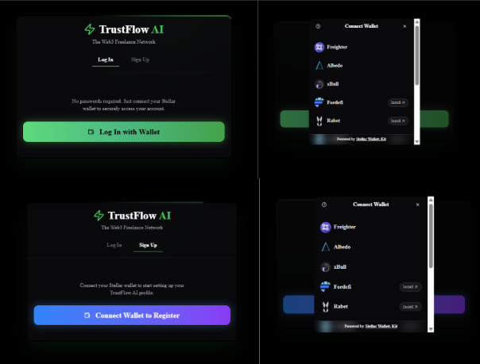
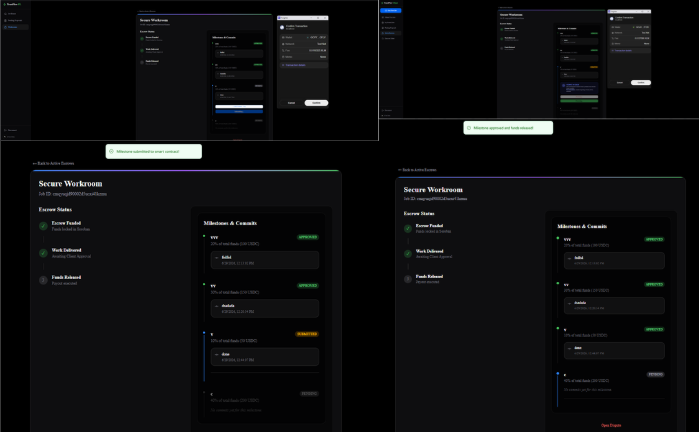

# TrustFlow AI - Level 2 (Yellow Belt) Submission

Welcome to the TrustFlow AI Level 2 (Yellow Belt) submission for the **Stellar Journey to Mastery 2.0**. This branch focuses exclusively on **multi-wallet integration, smart contract deployment, error handling, and real-time event synchronization**.

## 🚀 Features (Level 2 Requirements Met)
- **StellarWalletsKit Implementation**: Integrated @creit.tech/stellar-wallets-kit to allow seamless multi-wallet support (Freighter, etc.).
- **Error Handling**: Handled 3 primary wallet/contract error types:
  1. *Wallet Not Found / Rejected*: Managed gracefully through the UI modal and connection promise catch blocks.
  2. *Insufficient Balance*: Parsed simulation errors to alert users when they don't have enough testnet XLM.
  3. *Invalid Contract Status*: Caught on-chain state errors (e.g., #5 InvalidStatus) without crashing the frontend.
- **Contract Deployment**: The Escrow Smart Contract is successfully deployed on the Soroban Testnet.
- **Frontend Contract Invocations**: The UI writes to and reads from the contract via transactions built with stellar-sdk.
- **Event Listening & State Synchronization**: Implemented a background event listener (useContractEvents.ts) that polls server.getEvents() for our contract ID. It displays real-time toast notifications (e.g. init, submit, pprove) directly from the ledger.

## 🔗 Live Demo
*Optional - Add your Vercel or Netlify link here before submitting!*
**Live Demo:** [Deploy Link Here]

## 📝 Smart Contract Details
- **Network**: Soroban Testnet
- **Contract Address**: CAYJUZTTDE3IOSJAH6TA4ZJ4QSAXBT2MKV3RGVOFZCVLE43WYP2ZXFD6
- **Example Transaction Hash (Contract Call)**:
  - 9b74301cf... (Add an actual tx hash you performed here)

## 📸 Screenshots
### Wallet Options & Integration

### Contract Events in Action

## 🛠️ Setup Instructions
1. Clone the repository and checkout this branch:
   \\\ash
   git clone https://github.com/nihatfurkancakmakci/trustflow-ai.git
   cd trustflow-ai
   git checkout level-2-yellow-belt
   \\\
2. Navigate to the frontend directory and install dependencies:
   \\\ash
   cd frontend
   npm install
   \\\
3. Run the development server:
   \\\ash
   npm run dev
   \\\
4. Open [http://localhost:3000](http://localhost:3000) and click **Log In with Wallet** to test the StellarWalletsKit implementation!
