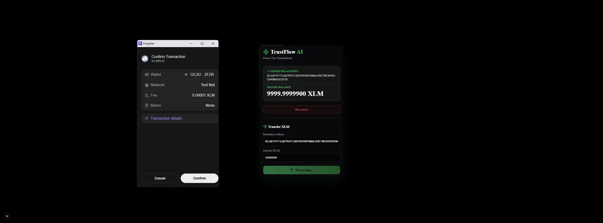

<div align="center">
  <h1>🌟 TrustFlow AI</h1>
  <p><strong>Secure. Fast. Decentralized. The Next-Gen Freelance & Project Operating System powered by Stellar.</strong></p>

  <div>
    
    
    
    
    
  </div>
</div>

<br />

> **🏆 Submission for the Stellar Journey to Mastery Program**
> This repository represents the evolution of TrustFlow AI, from a Level 1 (White Belt) foundation to a fully overhauled, premium Web3 ecosystem ready for Level 2 (Soroban Smart Contracts).

---

## 🌌 The Vision
TrustFlow AI bridges the gap between freelancers, clients, and decentralized finance. By leveraging the unmatched speed and low fees of the **Stellar Network**, we provide a trustless, automated, and frictionless payment infrastructure wrapped in a world-class UI.

## ✨ Key Features (Level 1 Mastery)
- 🎨 **Premium UI/UX**: An immersive "Deep Space" dark mode featuring glassmorphism, fluid `framer-motion` animations, and neon emerald accents.
- 🔐 **Seamless Wallet Integration**: One-click connect via the `@stellar/freighter-api`. 
- 📊 **Real-Time Testnet Data**: Live fetching of XLM balances directly from the Stellar Horizon nodes.
- ⚡ **Frictionless Transactions**: Peer-to-peer XLM transfers tested and verified, complete with instant transaction hashing and Stellar Expert explorer links.

---

## 📸 Visual Showcase & User Journey

We believe Web3 shouldn't be clunky. Here is the seamless user experience we've crafted:

<details open>
<summary><b>1. The Immersive Connect Screen</b></summary>
<br/>
<p align="center">
  
</p>
</details>

<details open>
<summary><b>2. Connected Dashboard & Live Balance</b></summary>
<br/>
<p align="center">
  
</p>
</details>

<details open>
<summary><b>3. Secure Freighter Approval</b></summary>
<br/>
<p align="center">
  
</p>
</details>

<details open>
<summary><b>4. Instant Transaction Verification</b></summary>
<br/>
<p align="center">
  
</p>
</details>

---

## 🚀 Getting Started

Experience the premium UI and Stellar integration locally in just a few steps:

### Prerequisites
- Node.js (v18+)
- [Freighter Wallet](https://freighter.app/) extension (Set to **Testnet**)

### Installation

1. **Clone the repository**
   ```bash
   git clone https://github.com/nihatfurkancakmakci/trustflow-ai.git
   cd trustflow-ai/frontend
   ```

2. **Install dependencies**
   ```bash
   npm install
   ```

3. **Ignite the server**
   ```bash
   npm run dev
   ```

4. **Explore**
   Open [http://localhost:3000](http://localhost:3000) and step into the future of decentralized work.

---

## 🗺️ Roadmap: What's Next? (Level 2 & Beyond)
With the Level 1 integration and UI overhaul fully completed, we are now architecting **Soroban Smart Contracts** to handle:
- Escrow systems for milestone-based payments.
- Trustless dispute resolution.
- Tokenized reputation scores for freelancers.

<br />

<div align="center">
  <p>Built with 💚 for the Stellar Ecosystem.</p>
</div>
