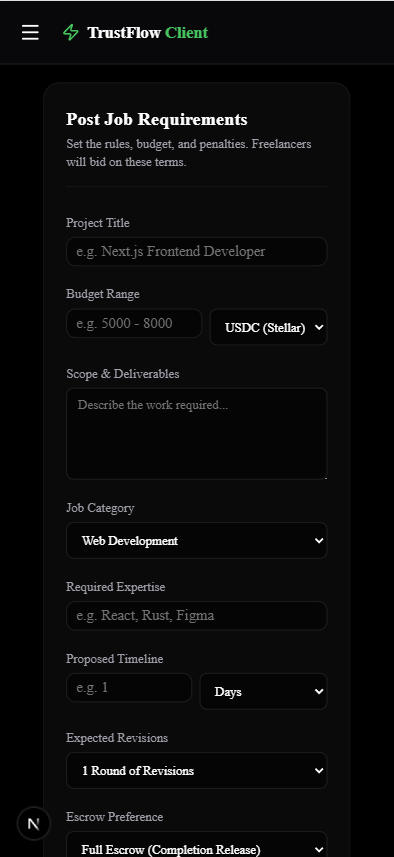
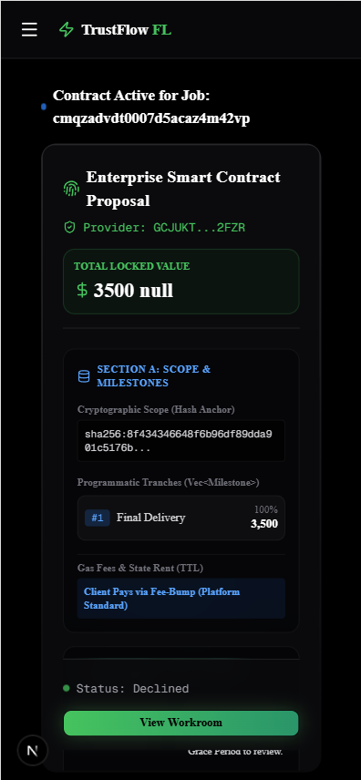
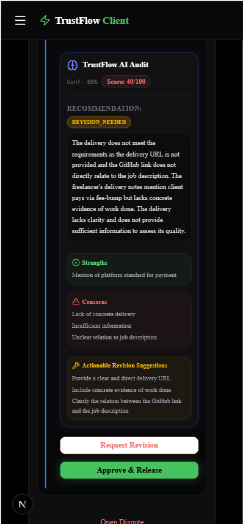
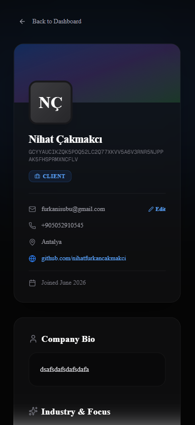
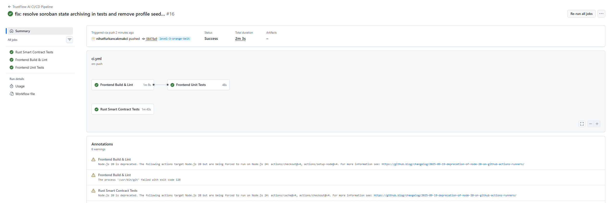

<div align="center">
  <h1>🌟 TrustFlow AI</h1>
  <p><strong>Secure. Fast. Decentralized. The Next-Gen Freelance & Project Operating System powered by Stellar & Soroban.</strong></p>

  <div>
    
    
    
    
    
  </div>
</div>

<br />

> **🏆 Submission for the Stellar Journey to Mastery Program (Level 3 - Orange Belt)**
> This sub-directory contains the Next.js 16 front-end application and the AI-auditing serverless routes for the TrustFlow AI ecosystem.

---

## ✨ Key Features (Level 3 - Orange Belt)

- 🔐 **Stellar & Soroban Escrow**: Milestone funds are locked securely in Soroban on-chain smart accounts and released step-by-step.
- ⚖️ **Soroban Arbitration & Dispute Oracle**: Programmable hooks to handle disputes via platforms, split balances, or oracle decisions.
- 🧠 **4-Tier Hybrid AI Delivery Auditor**: A fallback chain that runs dynamically when milestones are submitted to check code quality.
- 🐙 **GitHub Metadata Parser**: Submitting a GitHub URL dynamically extracts code additions, deletions, commit logs, and file changes.
- ⭐️ **Interactive Feedback & Reviews**: Star rating (1-5) and text feedback modal displayed in the workroom upon contract completion.
- 📱 **Mobile Responsive Design**: Fluid mobile layout optimized for all device sizes.

---

## 📜 Deployed Smart Contracts

* **Escrow Contract (Stellar Testnet)**:
  `CAYJUZTTDE3IOSJAH6TA4ZJ4QSAXBT2MKV3RGVOFZCVLE43WYP2ZXFD6`
* **Arbitration Oracle Hook**:
  `CDLZFC3SYJYDZT7K67VZ75HPJVIEUVNIXF47ZG2FB2RMQQVU2HHGCYSC` (Dynamic Stellar Testnet anchor address)

---

## 📸 Visual Showcase & User Journey

We believe Web3 shouldn't be clunky. Here is the seamless user experience we've crafted:

<details open>
<summary><b>1. Job Post Board & Creation</b></summary>
<br/>
<p align="center">
  
</p>
</details>

<details open>
<summary><b>2. Secure Workroom & Milestones</b></summary>
<br/>
<p align="center">
  
</p>
</details>

<details open>
<summary><b>3. Live AI Delivery Audit & Code Review</b></summary>
<br/>
<p align="center">
  
</p>
</details>

<details open>
<summary><b>4. Freelancer Rating & Reviews</b></summary>
<br/>
<p align="center">
  
</p>
</details>

<details open>
<summary><b>5. Automated CI/CD Testing & Pipeline</b></summary>
<br/>
<p align="center">
  
</p>
</details>

<details open>
<summary><b>6. Passing Test Suites</b></summary>
<br/>
<p align="center">
  
</p>
</details>

---

## 🚀 Getting Started

Experience the premium UI and Stellar integration locally in just a few steps:

### Prerequisites
- Node.js (v18+)
- [Freighter Wallet](https://freighter.app/) extension (Set to **Testnet**)

### Installation

1. **Install dependencies**
   ```bash
   npm install
   ```

2. **Database Migration**
   Setup your `.env` with your PostgreSQL database URL, then run:
   ```bash
   npx prisma db push
   npx prisma generate
   ```

3. **Run the server**
   ```bash
   npm run dev
   ```
   Open [http://localhost:3000](http://localhost:3000) and step into the future of decentralized work.

---

<div align="center">
  <p>Built with 💚 for the Stellar Ecosystem.</p>
</div>
